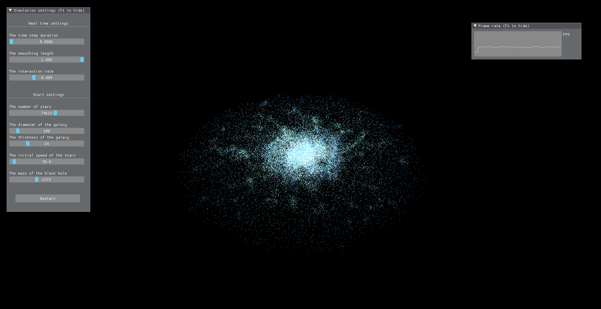

# Galaxy simulation


<br/>
This repository contains the source code of an n-body type particule simulation. Operate a basic galaxy simulation.

Idea from this [repo](https://github.com/angeluriot/Galaxy_simulation)

<br/>

<p align="center">
	
</p>


## Install

To build from source , first clone the repository
```bash
git clone https://github.com/Jonathan-Granier/Galaxy-simulation.git
```
In order to compile the project, the following tools and libraries are required:
* CMake 3.0
* MinGW (GCC 11.2)
* Vulkan 1.2

Use your favorite IDE to compile and run with CMake. 

## Controls
### Mouse
* `Right`   Control the camera.
* `Middle`  Zoom.

### Keyboard
* `F1` Hide the settings 

